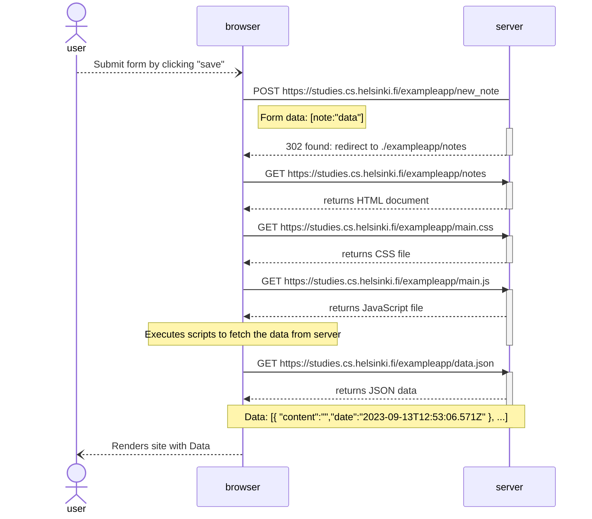

# Sequence diagram for submiting a new note

```mermaid

sequenceDiagram
  actor user
  participant browser
  participant server

  user--)browser: Submit form by clicking "save"
  browser->server: POST https://studies.cs.helsinki.fi/exampleapp/new_note
  note right of browser: Form data: [note:"data"]
  activate server
  server-->>browser: 302 found: redirect to ./exampleapp/notes
  deactivate server

  browser->>server: GET https://studies.cs.helsinki.fi/exampleapp/notes
  activate server
  server-->>browser: returns HTML document
  deactivate server

  browser->>server: GET https://studies.cs.helsinki.fi/exampleapp/main.css
  activate server
  server-->>browser: returns CSS file
  deactivate server

  browser->>server: GET https://studies.cs.helsinki.fi/exampleapp/main.js
  activate server
  server-->>browser: returns JavaScript file
  note over browser: Executes scripts to fetch the data from server
  deactivate server
  
  browser->>server: GET https://studies.cs.helsinki.fi/exampleapp/data.json
  activate server
  server-->>browser: returns JSON data
  note over browser,server: Data: [{ "content":"","date":"2023-09-13T12:53:06.571Z" }, ...]
  deactivate server

  browser--)user: Renders site with Data

```
