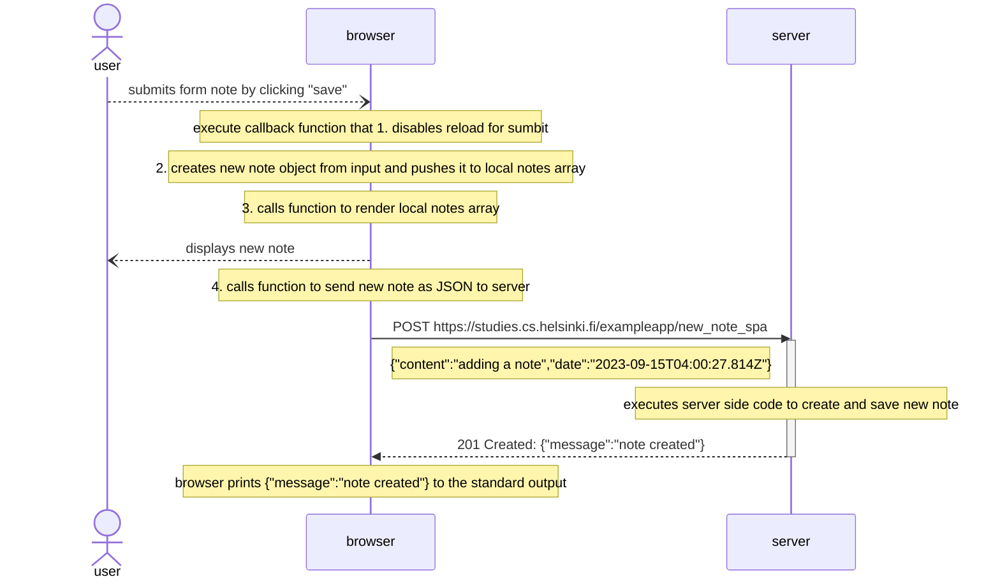

# 0.5: New note in Single page app diagram

```mermaid

sequenceDiagram
  actor user
  participant browser
  participant server
  
  user--)browser: submits form note by clicking "save"
  note over browser: execute callback function that 1. disables reload for sumbit
  note over browser: 2. creates new note object from input and pushes it to local notes array
  note over browser: 3. calls function to render local notes array
  browser--)user: displays new note
  note over browser: 4. calls function to send new note as JSON to server
  
  browser->>server: POST https://studies.cs.helsinki.fi/exampleapp/new_note_spa
  activate server
  note right of browser: {"content":"adding a note","date":"2023-09-15T04:00:27.814Z"}
  note over server: executes server side code to create and save new note
  server-->>browser: 201 Created: {"message":"note created"}
  deactivate server

  note over browser: browser prints {"message":"note created"} to the standard output

```
